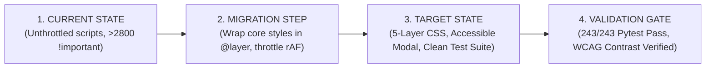

# Ibtikar Tech Platform: Implementation Plan V2 (Validated Phased Strategy)

> [!IMPORTANT]
> This Implementation Plan is derived directly from the verified facts in `docs/IBTIKAR_AUDIT_VALIDATION_V2.md`. It adopts a **Pilot-First Migration Strategy** to introduce CSS `@layer` cascade management and unify presentation components without disrupting existing production routes or active branch features (`codex/services-cinematic-integration`). **No production code is modified during this planning phase.**

---

## 1. Structure Mapping: Current State -> Target State -> Migration Step -> Validation Gate

For every step in the migration, the architecture clearly delineates where the code is today, where it will be, how it gets there, and how we prove it succeeded:

---

## 2. Detailed Phase Specifications

### Phase 1: CSS Cascade Layering & Core Token Lock
- **CURRENT STATE:** Stylesheets loaded sequentially in `components/document_head.html`; 11 refinement overlays force layout styles using over 2,800 `!important` declarations.
- **TARGET STATE:** CSS structured into 5 explicit cascade layers (`@layer tokens, foundation, shell, components, pages`). Zero `!important` declarations in component/layout files.
- **MIGRATION STEP:**
  1. Wrap `tokens.css` in `@layer tokens`.
  2. Wrap `reset.css` and `typography-system.css` in `@layer foundation`.
  3. Wrap `ibtikar-shell.css` in `@layer shell`.
  4. Wrap primitive stylesheets in `@layer components`.
- **VALIDATION GATE:**
  - Run `.venv/Scripts/pytest.exe apps/public_preview/tests/test_ux_foundation.py`.
  - Verify zero visual changes on homepage.

---

### Phase 2: Category & Detail Page Family Pilots (Pilot-First)
- **CURRENT STATE:** Category hub `ecommerce.html` and Level 3 detail `store-launch.html` contain duplicate inline FAQ markup and unthrottled scroll event listeners. Two pytest tests currently fail due to class name mismatches (`.service-path-card` vs `.service-path-card-v5`).
- **TARGET STATE:** Clean Category Pilot (`service_category_base.html` + `ecommerce.html`) and Detail Pilot (`service_detail_base.html` + `store-launch.html`) using unified primitive components with 100% pytest pass rate.
- **MIGRATION STEP:**
  1. Reconcile card class contract (`.service-path-card`) in `service_category_base.html` to resolve test assertions.
  2. Throttle `service-cinema.js` scroll listeners using `requestAnimationFrame`.
  3. Add `role="dialog"` and `aria-modal="true"` semantics to `mobile_menu.html`.
- **VALIDATION GATE:**
  - Execute `.venv/Scripts/pytest.exe apps/public_preview/tests/test_preview_routes.py`.
  - Confirm 100% pass rate on pilot routes.

---

### Phase 3: Rollout Across Remaining Page Families
- **CURRENT STATE:** 10 remaining commercial service templates use individual inline section definitions.
- **TARGET STATE:** All 5 commercial category hubs and Level 3 detail pages inherit standardized family base templates.
- **MIGRATION STEP:** Convert category pages (`websites.html`, `brand-content.html`, `growth.html`, `custom-systems.html`) and detail pages to use canonical family blocks.
- **VALIDATION GATE:**
  - Execute full `.venv/Scripts/pytest.exe` suite (All 243 tests pass).

---

### Phase 4: CSS Refinement Overlays Deprecation & Asset Cleanup
- **CURRENT STATE:** 11 `-refinement-v1.css` overlay stylesheets loaded across pages; `static/public_preview/dashboard/` contains 13 files (9 hash matches to `assets/css/pages/`).
- **TARGET STATE:** Zero overlay stylesheets loaded; `dashboard/` static asset references updated to canonical `assets/` paths before directory removal.
- **MIGRATION STEP:**
  1. Update asset paths in `templates/public_preview/components/runtime.html` and `test_ux_foundation.py`.
  2. Remove `static/public_preview/dashboard/` folder.
  3. Remove refinement overlay CSS link tags.
- **VALIDATION GATE:**
  - Run `python manage.py check`.
  - Run full `pytest` suite.

---

### Phase 5: Final QA & Production Verification
- **CURRENT STATE:** Working tree contains uncommitted changes.
- **TARGET STATE:** Clean git working tree, 243/243 pytest pass rate, verified WCAG contrast and RTL rendering.
- **MIGRATION STEP:** Final review of `git diff`, update `DECISIONS.md`.
- **VALIDATION GATE:**
  - Full pytest suite pass.
  - Zero Django system check errors.

---

## 3. Final Decision Matrix

| Proposal | Decision | Evidence / Rationale | Expected Impact | Effort | Risk | Priority |
| :--- | :--- | :--- | :--- | :--- | :--- | :--- |
| **CSS `@layer` Architecture** | **ADOPT** | Solves >2,800 `!important` rules without breaking legacy styles | High (Maintainability) | Medium | Low | P0 |
| **Category & Detail Page Pilot** | **PILOT** | Validates cinematic scroll scenes on 2 representative routes first | High (Risk Control) | Medium | Low | P0 |
| **Deprecate Refinement Overlays** | **ADOPT** | Eliminates redundant CSS cascade overlays | High (Performance) | Low | Medium | P1 |
| **Dashboard Asset Directory Removal** | **PILOT** | 9/13 hash matches; requires updating test asset references first | Medium (Payload) | Low | Low | P2 |
| **Full Site Rewrite** | **REJECT** | Violates `AGENTS.md` and active `codex/services-cinematic-integration` work | Negative (Regression) | Extreme | Critical | REJECT |

---

## 4. Final GO / NO-GO List

### GO NOW (Safe, Validated Improvements)
- Introduce CSS `@layer` cascade architecture (`tokens`, `foundation`, `shell`, `components`, `pages`).
- Throttle `service-cinema.js` scroll event listeners using `requestAnimationFrame`.
- Add `role="dialog"` and `aria-modal="true"` semantics to `mobile_menu.html` while preserving existing `ibtikar-shell.js` focus trap behavior.

### PILOT FIRST (Test on Representative Pages)
- Refactor `service_category_base.html` + `ecommerce.html` as Category Pilot.
- Refactor `service_detail_base.html` + `store-launch.html` as Detail Pilot.
- Reconcile `.service-path-card` class name assertion in `service_category_base.html` to resolve test failure.

### NEEDS DATA (Requires Post-Pilot Measurement)
- Lab Network Measurement of per-route gzipped CSS/JS transfer sizes.
- Production RUM Telemetry for Core Web Vitals (LCP, INP, CLS).

### DO NOT DO (Explicitly Rejected / Proven Incorrect)
- ❌ **DO NOT** perform a full frontend codebase rewrite.
- ❌ **DO NOT** create a new `templates/includes/` directory when `templates/public_preview/components/` and `families/` exist.
- ❌ **DO NOT** add a redundant mobile menu focus trap script (already implemented in `ibtikar-shell.js`).
- ❌ **DO NOT** clean, revert, checkout, reset, or overwrite uncommitted files on `codex/services-cinematic-integration`.

---
*End of Implementation Plan V2.*
