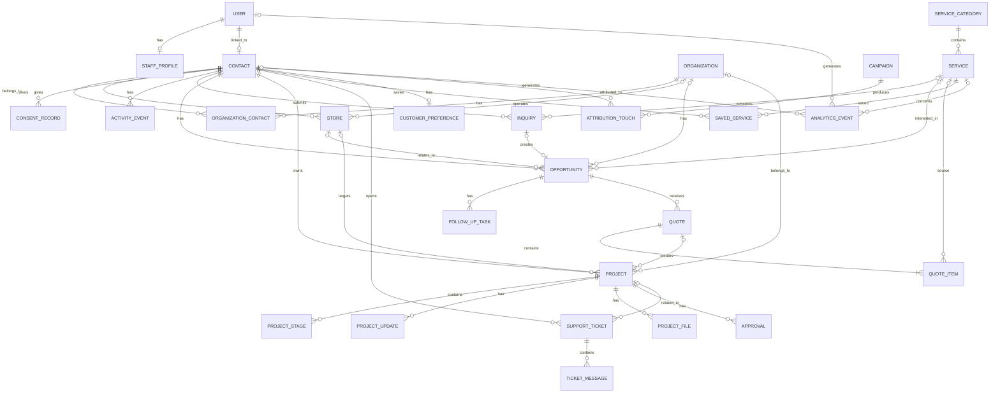
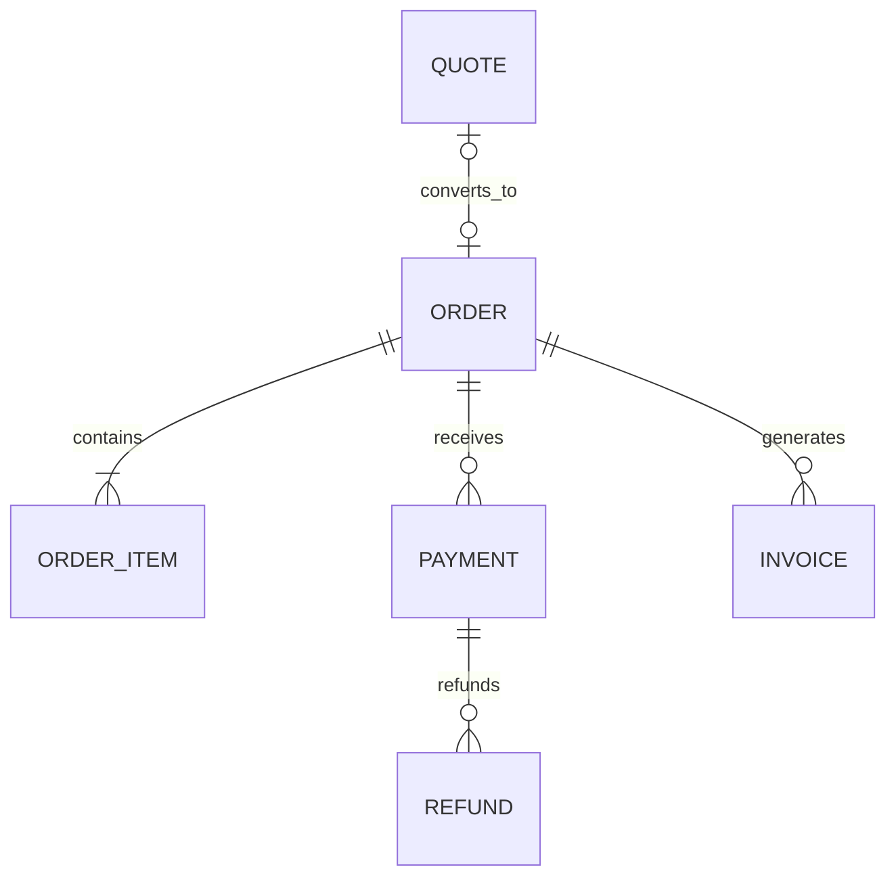

# ERD v1.0 — Ibtikar Tech Dashboard

هذا المستند هو المرجع الأساسي لعلاقات البيانات في الإصدار الأول.



## Core entities

### Accounts
- `User`
- `StaffProfile`

### CRM
- `Contact`
- `Organization`
- `OrganizationContact`
- `Store`
- `ConsentRecord`
- `ActivityEvent`

### Services
- `ServiceCategory`
- `Service`

> لا توجد ServiceFamily / ServicePackage / ServiceAddon في V1.

### Sales
- `Inquiry`
- `Opportunity`
- `FollowUpTask`
- `Quote`
- `QuoteItem`

### Customer portal
- `SavedService`
- `CustomerPreference`

### Projects
- `Project`
- `ProjectStage`
- `ProjectUpdate`
- `ProjectFile`
- `Approval`

### Support
- `SupportTicket`
- `TicketMessage`

### Marketing / Analytics
- `Campaign`
- `AttributionTouch`
- `AnalyticsEvent`

### Core audit
- `AuditLog`

## Identity rule

```text
User = authentication identity
Contact = CRM person
```

`Contact.user` nullable OneToOne. الضيف يمكن أن يصبح مستخدمًا لاحقًا دون فقدان تاريخه التجاري.

## CRM flow

```text
Contact
  -> Inquiry
  -> Opportunity
  -> Quote
  -> Project
```

`whatsapp_click` لا ينشئ Inquiry أو Opportunity؛ يسجل كـAnalyticsEvent فقط.

## Service catalog

```text
ServiceCategory
      -> Service
```

`Service` يحمل السعر ونوعه والتفاصيل والمخرجات والمتطلبات والمدة وطريقة الإجراء.

## Tharaa

ثراء ليست كيانًا داخل ERD التجاري في V1. هي صفحة Wagtail تسويقية، ويمكنها عرض Services مرتبطة من الكتالوج وروابط Demo/Marketplace خارجية.

## Future commerce boundary

غير منفذة في V1:



عند تشغيل الدفع المباشر فقط نضيف `Order`, `OrderItem`, `Payment`, `Invoice`, `Refund` دون تغيير CRM الأساسي.
